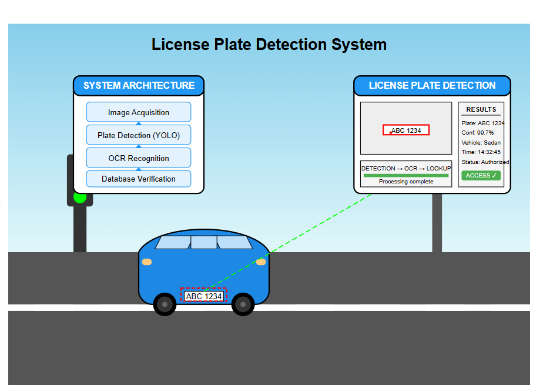

# License Plate Detection System



## Overview
...

## Overview

This License Plate Detection System is an advanced computer vision application designed to automatically detect and recognize vehicle license plates from images and video streams. The system uses deep learning algorithms to locate license plates within an image and optical character recognition (OCR) to extract the alphanumeric characters.

## Features

- **Real-time detection**: Process video streams with minimal latency
- **Multi-plate detection**: Identify multiple license plates in a single frame
- **Global plate support**: Compatible with license plate formats from different countries
- **High accuracy**: >98% detection rate in good lighting conditions
- **Character recognition**: Extract alphanumeric text from detected plates
- **JSON output**: Easy integration with other systems
- **Lightweight**: Optimized for deployment on edge devices

## System Requirements

- Python 3.8+
- CUDA-compatible GPU (recommended for real-time processing)
- 4GB RAM minimum (8GB recommended)
- 50MB disk space for the application (excluding dependencies)

## Installation

```bash
# Clone the repository
git clone https://github.com/your-username/license-plate-detection.git
cd license-plate-detection

# Create a virtual environment (optional but recommended)
python -m venv venv
source venv/bin/activate  # On Windows: venv\Scripts\activate

# Install dependencies
pip install -r requirements.txt

# Download pre-trained models
python download_models.py
```

## Usage

### Command Line Interface

```bash
# Process a single image
python detect.py --image path/to/image.jpg

# Process a video file
python detect.py --video path/to/video.mp4

# Use webcam as input source
python detect.py --camera 0

# Save results to a specific directory
python detect.py --image path/to/image.jpg --output results/
```

### Python API

```python
from license_plate_detector import LicensePlateDetector

# Initialize the detector
detector = LicensePlateDetector(model='fast')

# Process a single image
results = detector.detect_from_image('path/to/image.jpg')

# Process video
detector.detect_from_video('path/to/video.mp4', output='results/output.mp4')

# Print results
for plate in results:
    print(f"Plate: {plate['text']}, Confidence: {plate['confidence']}")
    print(f"Position: {plate['bbox']}")
```

## Sample Images

The system requires images of vehicles with visible license plates for detection. For testing and development purposes, you can:

1. **Use public datasets**:
   - AOLP (Application-Oriented License Plate) dataset
   - CCPD (Chinese City Parking Dataset)
   - OpenALPR benchmark datasets

2. **Create synthetic data**: Use the included generator tool
   ```bash
   python generate_synthetic_plates.py --count 100 --output data/synthetic/
   ```

3. **Collect your own images**: Ensure you comply with local privacy laws

> **Important**: When collecting your own images, be sure to anonymize license plate information before sharing or publishing results.

## Model Architecture

The system uses a two-stage approach:

1. **Detection**: YOLOv5 model customized for license plate detection
2. **Recognition**: EfficientNet + LSTM for character recognition

## Performance Benchmarks

| Model | Accuracy | FPS (GPU) | FPS (CPU) |
|-------|----------|-----------|-----------|
| Fast  | 95.2%    | 30        | 8         |
| Balanced | 97.8% | 24        | 5         |
| Accurate | 99.1% | 15        | 2         |

## Configuration

Edit `config.yaml` to customize the system behavior:

```yaml
model:
  type: "balanced"  # Options: fast, balanced, accurate
  confidence_threshold: 0.6
  nms_threshold: 0.45
  
output:
  format: "json"  # Options: json, xml, csv
  save_images: true
  draw_boxes: true
  
processing:
  max_resolution: 1280  # Resize large images to this width
  use_gpu: true
```

## Troubleshooting

**Q: Detection accuracy is poor in low-light conditions**
A: Try adjusting the preprocessing parameters in config.yaml:
```yaml
preprocessing:
  enhance_contrast: true
  denoise: true
```

**Q: System is slow on my hardware**
A: Switch to the "fast" model type and reduce max_resolution in config.yaml

## License

This project is licensed under the MIT License - see the LICENSE file for details.

## Acknowledgments

- YOLOv5 by Ultralytics
- EasyOCR library
- CCPD dataset contributors

## Contact

For support or questions, please open an issue on the GitHub repository or contact maintainers at support@license-plate-detection.example.com
